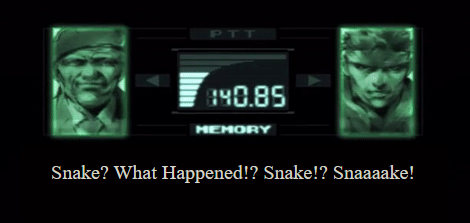
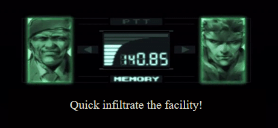
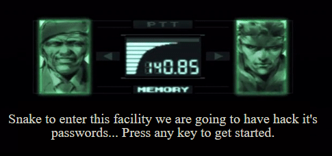
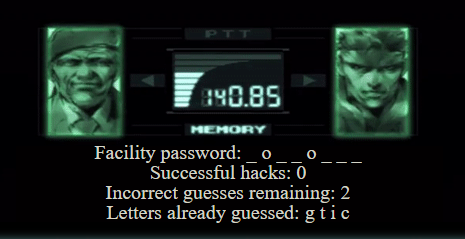

# Hangman

Play Hangman with the following rules:

You may have 6 wrong guesses for each word. Once you guess wrong for the 6th time, you will have to try again on a new word.

# How to win

Successfully guess every letter of the current 'Facility password' to win.

There is a final message that pops up if you guess every word.

# How to play

The game starts with an introductory message. Press any key to get the game started. You will have the 'Player Board' displayed.

Here is an example of the 'Player Board' looks like this .

Facility password: _ _ _ _ _ _ _ _  [This lets you know the word will have 8 letters.]

Successful hacks: 0 [This lets you know how many words you have guessed correctly.]

Incorrect guesses remaining: 6 [This lets you know how many letters you have guessed incorrect.]

Letters already guessed: [This lets you know what letters you have guessed already.]

If you guess a letter you have already guessed this message will appear - 

